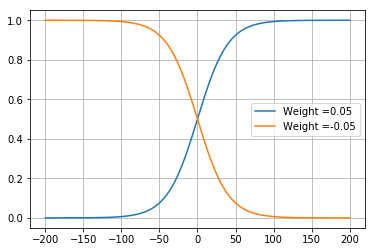

## Sigmoid function
Consider the equation $z=\Sigma{x_i*w_i}-\theta$ where $\theta$ is the bias and 

Sigmoid activation funtion  $y=\frac{1}{(1+{e}^{-z})}$

This means when calculating the output of a node, the inputs are multiplied by weights, and a bias value is added to the result. 


 ### Infulence of Bias:
 The bias value allows the activation function to be shifted to the left or right, to better fit the data. Hence changes to the weights alter the steepness of the sigmoid curve, whilst the bias offsets it, shifting the entire curve so it fits better. Note also how the bias only influences the output values, it doesn’t interact with the actual input data.
        <ul>
            <li>Case 1: When $\theta$ = 0: The Sigmoid functon passes through y=0.5 when z=0</li>
            <li>Case 2: When $\theta$ is +ve: The Sigmoid functon shifts towards RIGHT and passes through y=0.5 when z = $\theta$</li>
            <li>Case 3: When $\theta$ is -ve: The Sigmoid functon shifts towards LEFT and passes through y=0.5 when z = $-\theta$</li>
        </ul>
    If $\theta$ increases the graph shifts towards Right and if $\theta$ decreases then the graph shifts towards left.
    


```python
from Figures import sigmoidBias
sigmoidBias.draw()
```


### Weight Magnitude:
<ul>
    <li>As the weight increases the sigmoid function approaches Binary Threshold Unit neuron. The slope becomes steeper.The higher saturation region and lower saturation regions dominate the linear region of the sigmoid function. Thus the output becomes insensitive to the change in inputs. We can use this whenever we are sure about the output.</li>
    <li>As the weight decreases the slope of the sigmoid decreases as well.The linear region is more. The advantage of linear region is that it is very sensitive to the change in the input which helps in the process of learning the value of weights.</li>
</ul>


```python
from Figures import sigmoidWeight
sigmoidWeight.draw()
```


### Sign of Weights:
When the weight is +ve the sigmoid is "S" shape curve with +ve slope in the linear region. But when the weight is -ve the sigmoid curve is mirror imaged and the slope of the linear region is negative. 


```python
from Figures import sigmoidWeightSign
sigmoidWeightSign.draw()
```




