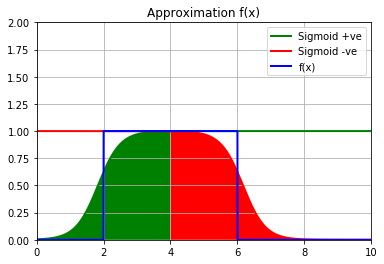

# Approximating functions using Sigmoid Perceptrons

In Multi-layer Feed Forward neural networks, you can observe a new found capability of a perceptron network to learn non-linearly separable data sets. You have witnessed that networks with 2 or more layers can learn a non-linear decision boundary.  

Here, you will be presented with an example, which aims to show, how a function can be approximated using the Sigmoid.

Before we continue, this is how a sigmoid looks like


```python
from Figures import Sigmoid
Sigmoid.draw()
```


## Approximating functions with Sigmoid 

Let us consider, we want to approximate the following function

$$
\begin{align}
    f(x) = 
    \begin{cases}
        1 \ \ \text{if } 2 \le x \le 6 \\
        0 \ \ \text{Otherwise}
    \end{cases}
\end{align}
$$


```python
from Figures import f
f.draw()
```


We can use sigmoid with large weights to approximate the above function like so...

Consider the sigmoid used as show below


```python
from Figures import approx1
approx1.draw()
```


As you can notice a good portion of the function is approximated. But, a single perceptron is not enough. **Why?** 

The above Sigmoid outputs a 1 for all values of x that are approximately greater than 2. We would need another sigmoid perceptron to check the second boundary($x \le 6$).

We make use of a perceptron with negative large weights ...


```python
from Figures import approx2
approx2.draw()
```


Now, the above perceptron would give us all the points that have the value of x approximately less than 6


```python
from Figures import approx3
approx3.draw()
```





A good portion of the function has now been approximated. We have used two perceptrons to approximate the function, but we also need a third Perceptron to comibine the results of the two. We need a perceptron that does the **AND** operation.

We require a total of 3 Perceptrons

The above function approximation can be depicted as the below neural network architecture

Now let us see in detail how it works.

### At $h_1$:
$10\thinspace x_1-20\thinspace x_0 \thinspace > \thinspace  0  \implies 10 \thinspace x_1 -20 \thinspace > \thinspace  0 $ [Since, $x_0$ = 1 because it is bias].

The above equation is satisfied $\forall x \in (2,\infty)$


### At $h_2$:
$-10\thinspace x_1+60\thinspace x_0 \thinspace > \thinspace  0  \implies -10 \thinspace x_1 +60 \thinspace > \thinspace  0 $ [Since, $x_0$ = 1 because it is bias].

The above equation is satisfied $\forall x \in (-\infty,6)$


### At $h_3$:
$10\thinspace h_1+10\thinspace h_2 -15\thinspace x_0 \thinspace > \thinspace  0  \implies 10\thinspace h_1+10\thinspace h_2 \thinspace > \thinspace  15$ [Since, $x_0$ = 1 because it is bias].

The above equation is satisfied only when both h1 and h2 values evaluate to one. That means this node with the weight and bias values of 10 and -15 respectively acts as an **AND** gate
