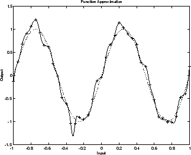
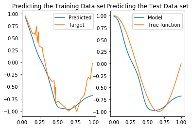
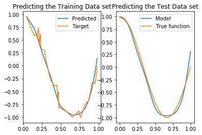

## Overfitting

One of the problems that occur during neural network training is called overfitting. The error on the training set is driven to a very small value, but when new data is presented to the network the error is large. The network has memorized the training examples, but it has not learned to generalize to new situations.

An overfitted model is a statistical model that contains more parameters than can be justified by the data. For example in  a  MLFFNN having more number of hidden units in than required leads to overfitting. If the number of hidden units are more, then each of the hidden nodes will memorise the training data and this leads to minimum generalization.

In general it is suggested that the number of hidden units should be $\frac{Number of Patterns}{10} $. Too many hidden units will cause overfitting and very less will cause underfitting.

The following figure shows the response of a 1-20-1 neural network that has been trained to approximate a noisy sine function. The underlying sine function is shown by the dotted line, the noisy measurements are given by the + symbols, and the neural network response is given by the solid line. Clearly this network has overfitted the data and will not generalize well.


One method for improving network generalization is to use a network that is just large enough to provide an adequate fit. The larger network you use, the more complex the functions the network can create. If you use a small enough network, it will not have enough power to overfit the data. 

Unfortunately, it is difficult to know beforehand how large a network should be for a specific application. There are two other methods for improving generalization : <i><b>regularization</b></i> and <i><b>early stopping</b></i>


Below are the results obtained after overfitting the neural network with 20 hidden nodes.


```python
from Figures import mlffnn
mlffnn.overFitting()
```





### Without Over Fitting
Here the number of hidden nodes used is 7


```python
from Figures import mlffnn
mlffnn.withoutOverFitting()
```





It is observed from the above two that the model with overfitting fails in generalising the sine curve but the other model without overfitting generalises well.
