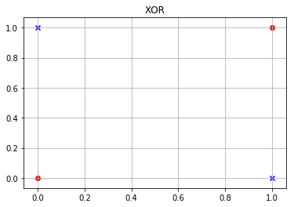
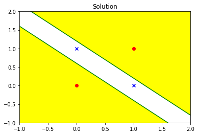

# Non-linear classification examples

One of the staple features of the multi layer layer feed forward neural network is that it can learn non-linear boundaries.

This is section presents the most simple and widely used non-linear classification exmaple: the **XOR** problem.

## The XOR Problem

The truth table for **XOR** is given below

|X|Y|Output|
|:---:|:---:|:---:|
|0|0|0|
|0|1|1|
|1|0|1|
|1|1|0|

$$
Y = X_1 \oplus X_2
$$


```python
from Figures import xor
xor.draw()
```





A single perceptron will fail to solve the **XOR** problem.

Consider that 

$(0,0)\  , \ (1,1) \mapsto 1 \\
(1,0)\ , \ (0, 1) \mapsto 0$

Then a single perceptron will have to solve the following equations:

$
w_1 + w_2 \ge \theta ...(1)\\
$

$
\theta \ge 0 ...(2)\\
$

$
w_1 \lt \theta ...(3)\\
$

$
w_2 \lt \theta ...(4)\\
$

The above four inequalities are impossoble to solve for.


The solution is to make use of more than one perceptron to learn these features.

It is very clear from the above plot that we cannot have a single boundary separating the data in two seperate classes. We need at least 2 linear boundaries.


```python
from Figures import solution
solution.draw()
```





Each green line is a decision boundary that a perceptron learns. We have used two perceptrons to learn a decision boundary that seperates the two classes as shown in the plot above. The yellow shaded region can be cosidered as one region. while the unshaded region as the other.
