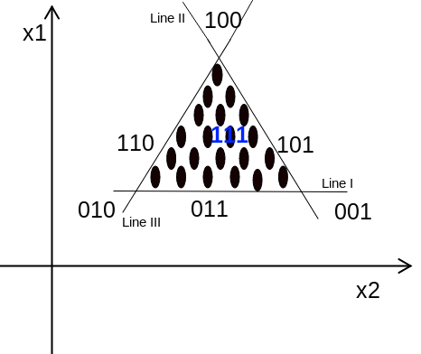
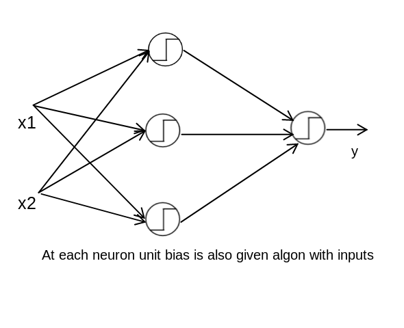
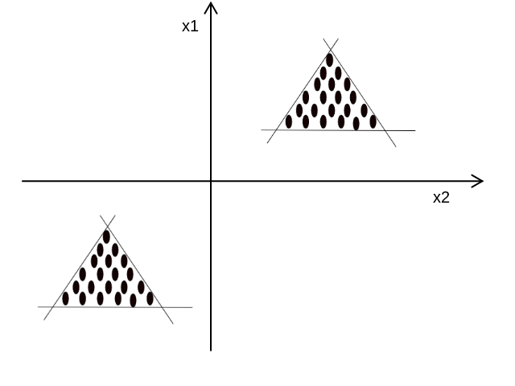
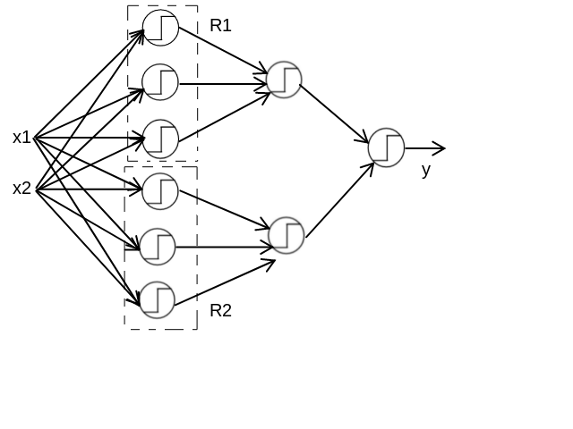

### Role of hidden layer

The hidden layer projects the inputs into a space where we can find a linear seperation. Any continuous function can be represented or approximated by many number of nodes in the hidden layer. Now let us try to create a neural network architecture for the below example.

The neural network has to detect if the point is located in the traingular region or not.
 

<ul>
    <li>It can be clearly observed that the data set is **NOT** Linearly seperable.</li>
    <li>The number of inputs is 2 (because it is 2 dimensional).</li>
    <li>The number of hidden units required in the hidden layer is 3 because, we know that each hidden unit represents a line and as, in the given example the neural network has to distinguish between the points present inside and ouside of the triangular (3 edges) region  we require 3 hidden nodes.</li>

</ul>
 
 
If the point falls inside the triangular region then the neural network should return the value 1 else it should return 0.
#### Line I:
1. If point is **above** Line I then it can be represented as **1**
2. If point is **below** Line I then it can be represented as **0**

#### Line II:
1. If point is **left** Line II then it can be represented as **1**
2. If point is **right** Line II then it can be represented as **0**

#### Line III:
1. If point is **right** Line III then it can be represented as **1**
2. If point is **left** Line III then it can be represented as **0**

If the combination of line I,II,III is **111** then we can say that the point lies in the traingular region.
The above problem can be realised as the below neural network.

Similarly, now let us consider the below example in which the output of the neural network should be 1 if the data point lies in either of the two regions.

In this case as there are 6 lines we require 6 hidden  nodes to represent each one of them. And also we need one mode hidden layer in order to implement **OR** gate.

The 1st hidden layer implements 2 **AND** gates and the 2nd hidden layer implements **OR** gate.
