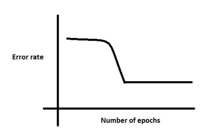
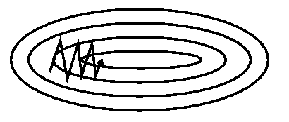

# Practical Issues

## The Local Minima Problem

The backpropagation algorithm employs gradient descent by following the slope of RMS error value $ E_p$ downward along with the change in all the weight values. The weight values are constantly adjusted until the value of $ E_p$ is no longer decreasing. Since the RMS error value is very complex function with many parameter values of weights, it is possible that the backpropagation network may converge into a local minima instead of the desired global minimum.

This is undersirable.

As the gradient descent algorithm tends to proceed in the direction that has the less error. In the above case, it makes sense for the algorithm to move towards the local minima rather than moving in direction of the global minima(mind you, this is towards the direction where the error increases intially, albeit a sharp decrease later.)

At both the local and global minima we have $\frac{\partial E}{\partial w} \approx 0$

Notice that after certain epochs, the error has saturated, this is a staple feature of the local minima problem. We can use different methods like regularization and momentum term to avoid the local minima problem

## Training

### Gradient descent 

Gradient descent is an optimization algorithm used to minimize some function by iteratively moving in the direction of steepest descent as defined by the negative of the gradient. In machine learning, we use gradient descent to update the parameters of our model. Parameters refer to weights in neural networks.

Starting at the top, we take our first step downhill in the direction specified by the negative gradient. Next we recalculate the negative gradient (passing in the coordinates of our new point) and take another step in the direction it specifies. We continue this process iteratively until we get to the bottom of our graph, or to a point where we can no longer move downhill–a local minimum.

### Learning rate
The size of these steps is called the learning rate. With a high learning rate we can cover more ground each step, but we risk overshooting the lowest point since the slope of the hill is constantly changing. With a very low learning rate, we can confidently move in the direction of the negative gradient since we are recalculating it so frequently. A low learning rate is more precise, but calculating the gradient is time-consuming, so it will take us a very long time to get to the bottom.

### Cost function
A Loss Functions tells us “how good” our model is at making predictions for a given set of parameters. The cost function has its own curve and its own gradients. The slope of this curve tells us how to update our parameters to make the model more accurate.

### Gradient descent variants
There are three variants of gradient descent, which differ in how much data we use to compute the gradient of the objective function. Depending on the amount of data, we make a trade-off between the accuracy of the parameter update and the time it takes to perform an update.

#### Batch gradient descent
Vanilla gradient descent, aka batch gradient descent, computes the gradient of the cost function w.r.t. to the parameters $\theta$ for the entire training dataset: $\theta = \theta - \eta * \nabla_\theta * J(\theta)$

As we need to calculate the gradients for the whole dataset to perform just one update, batch gradient descent can be very slow and is intractable for datasets that don't fit in memory. Batch gradient descent also doesn't allow us to update our model online, i.e. with new examples on-the-fly.

#### Stochastic gradient descent
Stochastic gradient descent (SGD) in contrast performs a parameter update for each training example 
$x_i$ and label $y_i$:

$\theta = \theta - \eta * \nabla_\theta * J(\theta; x_i; y_i)$

Batch gradient descent performs redundant computations for large datasets, as it recomputes gradients for similar examples before each parameter update. SGD does away with this redundancy by performing one update at a time. It is therefore usually much faster and can also be used to learn online.
SGD performs frequent updates with a high variance that cause the objective function to fluctuate heavily as in Image 1.

While batch gradient descent converges to the minimum of the basin the parameters are placed in, SGD's fluctuation, on the one hand, enables it to jump to new and potentially better local minima. On the other hand, this ultimately complicates convergence to the exact minimum, as SGD will keep overshooting. However, it has been shown that when we slowly decrease the learning rate, SGD shows the same convergence behaviour as batch gradient descent, almost certainly converging to a local or the global minimum for non-convex and convex optimization respectively. Note that we shuffle the training data at every epoch.

#### Mini-batch gradient descent
Mini-batch gradient descent finally takes the best of both worlds and performs an update for every mini-batch of n training examples:

$\theta = \theta - \eta * \nabla_\theta * J(\theta; x_{i:i+n}; y_{i:i+n})$

This way, it 
* Reduces the variance of the parameter updates, which can lead to more stable convergence 
* Can make use of highly optimized matrix optimizations common to state-of-the-art deep learning libraries that make computing the gradient w.r.t. a mini-batch very efficient. 

Common mini-batch sizes range between 50 and 256, but can vary for different applications. Mini-batch gradient descent is typically the algorithm of choice when training a neural network and the term SGD usually is employed also when mini-batches are used. 

## Influence of learning rate on convergence

Choosing a proper learning rate can be difficult. A learning rate that is too small leads to painfully slow convergence, while a learning rate that is too large can hinder convergence and cause the loss function to fluctuate around the minimum or even to diverge.

Learning rate schedules try to adjust the learning rate during training by e.g. annealing, i.e. reducing the learning rate according to a pre-defined schedule or when the change in objective between epochs falls below a threshold. These schedules and thresholds, however, have to be defined in advance and are thus unable to adapt to a dataset's characteristics.

Additionally, the same learning rate applies to all parameter updates. If our data is sparse and our features have very different frequencies, we might not want to update all of them to the same extent, but perform a larger update for rarely occurring features.

## Influence of Momentum on convergence
SGD has trouble navigating ravines, i.e. areas where the surface curves much more steeply in one dimension than in another, which are common around local optima. In these scenarios, SGD oscillates across the slopes of the ravine while only making hesitant progress along the bottom towards the local optimum as in Image 1.

Without Momemtum

With Momemtum

Momentum is a method that helps accelerate SGD in the relevant direction and dampens oscillations as can be seen in Image 2. It does this by adding a fraction 
γ
 of the update vector of the past time step to the current update vector:

$w_{ij}(t+1) = w_{ij}(t) + (1 - \alpha)\Delta w_{ij}(t+1) + \alpha \Delta w_{ij}(t)$

Note: Some implementations exchange the signs in the equations. The momentum term $\alpha$ is usually set to 0.9 or a similar value.

Essentially, when using momentum, we push a ball down a hill. The ball accumulates momentum as it rolls downhill, becoming faster and faster on the way (until it reaches its terminal velocity if there is air resistance, i.e. 
$\alpha \lt 1$). The same thing happens to our parameter updates: The momentum term increases for dimensions whose gradients point in the same directions and reduces updates for dimensions whose gradients change directions. As a result, we gain faster convergence and reduced oscillation.
