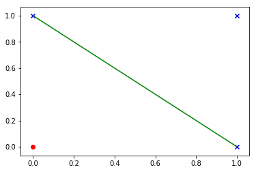

# Linear Decision Boundary by a Perceptron

## Perceptron

The Perceptron is the first generation of neural networks. It was modeled to emulate the learning behaviour of our brain.

A perceptron can be visualized as follows:


---

The <span style="color:blue">blue</span> nodes are the inputs to the neuron.

The <span style="color:green">green</span> nodes are the weights that are learned by the Perceptron algorithm.

## The Weighted Sum

Consider the above diagram, we have, $n + 1$ inputs and $n + 1$ corresponding weights.

The weighted sum refers to the process of multiplying the $i$th input to it's corresponding $i$th weight, _i.e._

$$
\begin{align}
x_{0} * w_{0} + x_{1} * w_{1} + x_{2} * w_{2} + ... + x_{n} * w_{n}
\end{align}
$$

### Weighted Sum

$$
z = \sum_{i=0}^{i=n} x_{i}w_{i}
$$

Notice that the first input is 1, which boils the equation down to

$$
z = \sum_{i=1}^{i=n} x_{i}w_{i} + w_{0}
$$

The $w_{0}$ term is called as bais term as is often written as $b$

$$
z = \sum_{i=1}^{i=n} x_{i}w_{i} + b
$$

## The Activation function

Finally the result of the above summation is run through a function (typically non-linear), this function is know as the activation function.

Their main purpose is to convert an input signal of a neuron in the Perceptron network to an output signal. This output signal is then used to make a decision about the class that the input pattern belongs to.

In the above diagram, the activation function is defined as follows:

$$
\begin{align}
  \text{g}(z) =
  \begin{cases}
            1 & \text{if} \ z \ge \theta \\
            0 & \text{otherwise} \\
  \end{cases}
\end{align}
$$

The above funtion is know as the _Heaviside step function_.

## The decision boundary

Consider two vector that each belong to a different class(say _A_ and _B_). The Perceptron can be used to classify them into their respective classes.

We can say that the input vector belongs to the,<span style="color:red"><b>class A</b></span> if it fires(the output of the activation function is high) otherwise, it belongs to <span style="color:blue"><b>class B</b></span>.

```python
%load_ext autoreload
```

```python
%autoreload 2
from figures import figure1
# Point 1, it will be the red line and belong to class 0
p1 = [10, -8]
# Point 2, it will be the blue line and belong to class 1
p2 = [10, 5]
figure1.draw([p1, p2])
```


The green line is the weight vector learned $w^{*}$

## Decision boundary for AND and OR

```python
from figures import and_boundary
and_boundary.fit()
```


```python
from figures import or_boundary
or_boundary.fit()
```


