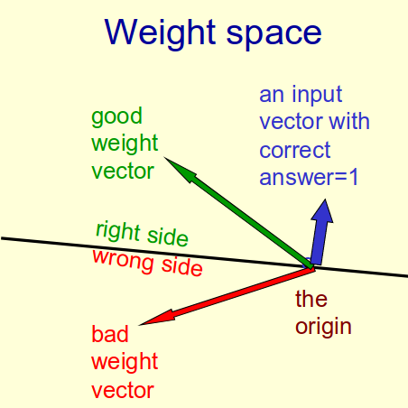
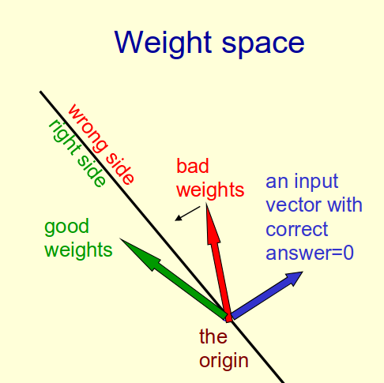
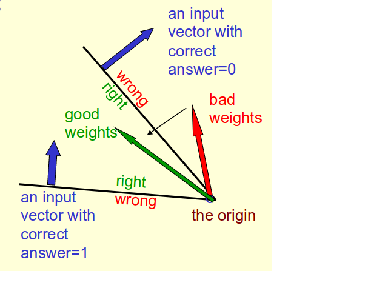
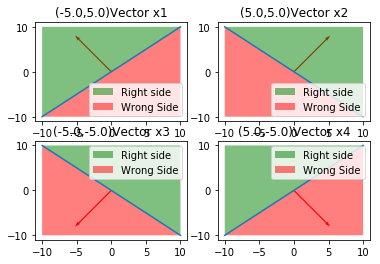
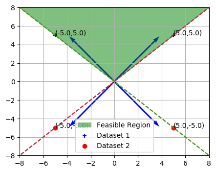
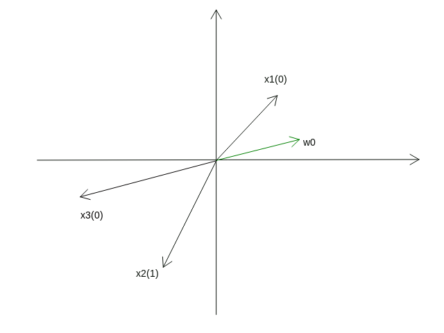
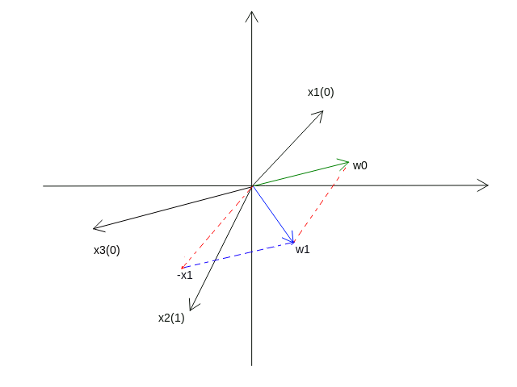

## Feasible region for multiple input
The Feasible Region is the cone or area in which the solution weight vector resides. The solution weight vector is not unique all the time, it definetly lies in the feasibility cone.It is the function of the orientation in which the input vectors are alligned.

### How can we claculate the cone of feasibility given a few input vectors?
<ul>
    <li>Every input vector has a plane (Hyper palne) which is perpendicular to the input vector and it passes through the origin. The black line in the below image is the hyper plane(A line in this case) whic divides the plane into two halves.  
    <br/>
    
    </li>
    <br/>
    <li>On one side of the plane the output is wrong because the scalar product of the input vector and the weight vector has wrong sign.</li>
    <li>The scalar product of two vectors x and w is given by the below formula:
        $  \mathbf{x.w} = \mathbf{|x||w|\cos\alpha }$</li>
    <li>For example let us consider an input vector whose desired output is "1" (the left side figure). The right side of the weight vector is determined by the sign of the Dot product or Scalar product of the weight vector and the inpupt vector. In this case if the dot product is <b>positive</b> then it is the right region else it is the wrong region of weight vector</li>
    <li>Similarly if the desired output for input vector is "0" (the right side figure) then the right side of the weight vector is where the dot product sign is <b>negative</b> </li>
    <li>If the weight vector is found to be present in the wrong side then the weight will be updated by the formula $  w_{new}=w_{old} - \eta * x$</li>
</ul>

### The Cone of Feasible solutions


To get all training cases right we need to find a point on the right side of all the planes. There may not be any such point. For Linearly seperable data there definetely exists cone of feasibility.

If there are any weight vectors that get the right answer for all cases, they lie in a hyper-cone with its apex at the origin. So the average of two good weight vectors is a good weight vector. 

### Learning Process
The weights have to be adjusted by adding or subtracting. Consider the following homogeneous inputs:
<ol>
<li>$ \vec{x_1}^1 $ => $x_1 $ is a vector whose desired output is 1. The right region is towards the vector direction.</li>

<li> $\vec{x_2}^1$ => $x_2 $is a vector whose desired output is 1.The right region is towards the vector direction.</li>
<li>$  \vec{x_3}^0 $=> $ x_3$ is a vector whose desired output is 0.The right region is away from the vector direction </li>

<li> $ \vec{x_4}^0 $=>$ x_4 $ is a vector whose desired output is 0.The right region is away from the vector direction</li>
</ol>


```python
from Figures import rightSideWrongSide
rightSideWrongSide.draw()
```





Below image shows the intersection of all the four right regions of the input vectors. It gives us the <b>Cone of Feasibility.</b> 

Note: The vectors are not alligned with the dotted lines because the image displayed is not in the shape of square. 


```python
from Figures import feasibleCone
feasibleCone.draw()
```





The solution weight vector obtained depends upon the following three factors
<ol>
    <li>Order of presenting the input vectors</li>
    <li>The amount of correction done i.e., the learning rate</li>
    <li>Initial choice of weight vector</li>
</ol>

If the cone of feasibility is very narrow then the algorithm takes long time to settle down.

If $  \vec{w}^* $is the solution weight vector then for the given example able it solves the below ineaqualities

$  \vec{x_1}^1 =>  \vec{w}^*.\vec{x}^1>0  =>  {w_1}^* {x_1}^1+{w_1}^* {x_2}^1>0$

$  \vec{x_2}^1 =>  \vec{w}^*.\vec{x}^2>0 => {w_1}^* {x_1}^2+{w_1}^* {x_2}^2>0$

$ \vec{x_3}^0 =>  \vec{w}^*.\vec{x}^3<0 => {w_1}^* {x_1}^3+{w_1}^* {x_2}^3<0$

$ \vec{x_4}^0 =>  \vec{w}^*.\vec{x}^4<0 => {w_1}^* {x_1}^4+{w_1}^* {x_2}^4<0$

The solution weight vector solves the above inequalities simultaneously.

### Correction

Consider three input vectors showm in the above figure $ \vec{x_1}^0,\vec{x_2}^1,\vec{x_3}^0$.  Let us consider that the initial input vector picked up is x<sub>1</sub> and the random weight vector lies in the wrong region i.e., the output desired output is 0 but the actual output is 1. Hence the weight needs to be updated. It is done as follows:

$ \vec{w_1}=\vec{w_0} - \eta*\vec{x_1}$

<b>After Correction</b>



$  \vec{w_1}$ is now alligned in the right region of $  \vec{x_2}$ that is expecting 1 as output.

$  \vec{w_1}$ gives wrong output for  $  \vec{x_3}$ which is expecting 0 as output. Hence the following correction is made

$ \vec{w_2}=\vec{w_1} - \eta*\vec{x_3}$
So this process continues and final weight vector is calculated which will be present in the feasible region. As long as there are finitely defined inputs that are linearly seperable this algorithm converges.
