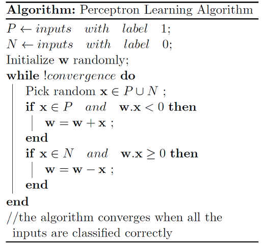

# The Perceptron learning algorithm

We cover the perceptron learning algorithm in detail. Let us have a look at what the perceptron alorithm is first.

All the magic happens inside the little while loop. Pay a close attention to that. 

Let us now go over each statement one by one:

1. **Pick a random vector, from the set of all input vectors. Note that $P \cup N$ is our complete data set.**

2. **We encounter a if block that considers the possoble cases. The vector can either belong to a Positive class or it can belongs to a Negative class.**
     
     **Case 1:** The vector is from set $P$, and $w*x \lt 0$
      This is the case when the we have an input pattern that belongs to the positive class but, it gets misclassified as vector that belongs to the negative class. Which implies that we need to correct out vector to $w$. 
      
      This correction is given as $w = w + x$, we will see the intuition behind this correction later.
      
      **Case 2:** The vector is from set $N$, and $w*x \ge 0$
      This is the case when the we have an input pattern that belongs to the negative class but, it gets misclassified as vector that belongs to the positive class. Which again implies that we need to make a correction to $w$. 
      
      This correction is given as $w = w - x$
      
And that's about it. Please keep in mind that the above additions are vector additions and that alothoug the figure does not show it explicity, both $w$ and $x$ are vectors. We consider only the cases that is mentioned above as it infringes the perceptron rule. (The one which states that if the dot product is positive, then the input vector must belong to the positive class, or otherwise, the negative class).

Now, as promised, we come to the part where we try to understand as to why these corrections work.

Consider, that $x$ is an input vector that belongs to the Positive class. 

$x \epsilon P$

Before, we answer the question, we note that 

$$
\cos \alpha = \frac{w * x}{\lvert w \rvert * \lvert x \rvert}
$$

Here, $\alpha$ is the angle between the $\vec{w} \text{and} \vec{x}$. 

As per the perceptron rule, if $\vec{x} \epsilon P$, we should have that $w * x \ge 0$. 

Since the cosine of the angle between the vectors is proportional to the dot product, $\cos \alpha \ge 0$.
One possiblity is when $0 \le \alpha \le 90$.

So, whatever the vector $w$ may be, as long as it makes an angle less that 90 with the positive patterns and an angle more than 90 with the negative samples, we are good.

Now, on the eve of a misclassification:

$
\text{when} \ w_{new} = w_{old} + x \\
$

$
\cos \alpha \propto w_{new}*x \\
$

$
\cos \alpha \propto (w_{old} + x) * x \\
$

$
\cos \alpha \propto (w_{old} * x) + (x * x) \\
$

$
\cos \alpha \propto (w_{old} * x) + {\lvert x \rvert}^2 \\
$

$
\implies \cos \alpha \ge \cos \alpha_{old} \\
$

Increasing the value of $\cos \alpha$ means decreasing the angle $\alpha$. This decrease in the angle is what we desire. Similarly,

$
\text{when} \ w_{new} = w_{old} - x \\
$

$
\cos \alpha \propto w_{new}*x \\
$

$
\cos \alpha \propto (w_{old} - x) * x \\
$

$
\cos \alpha \propto (w_{old} * x) - (x * x) \\
$

$
\cos \alpha \propto (w_{old} * x) - {\lvert x \rvert}^2 \\
$

$
\implies \cos \alpha \le \cos \alpha_{old} \\
$

Decreasing the value of $\cos \alpha$ means increasing the angle $\alpha$. Again, this increase is something that is desired.

# The Perceptron Convergence Theorem

We present the convergence theorem in this section. We see what guarantees does the above learning algorithm provide.

***If the sets $P$ and $N$ are finite and linearly separable. then the perceptron learning algorithm updates the weight vector, a finit number of times***

Before we present the proof, we list the assumption made:

* Let $P^{'}$ be $P \cup N^{-}$, where $N^{-}$ is the set of negated vectors in $N$

    *The only test for $P^{'}$ is that the dot product must be positive*

* Let all the vectors in $P^{'}$ be normalised so that ${\lvert}\vec{p_{\text{i}}}{\rvert} = 1$

* We assume that the solution weight vector $w^{*}$ exists and that ${\lvert}\vec{w^{*}}{\rvert} = 1$

### ***Proof***

Assume that after $t + 1$ steps the weight vector is $\vec{w_{t + 1}}$. This means that at time $t$, some pattern $p_{i} \ \epsilon \ P^{'}$ that was presented at time $t$ was missclassified.

$$
\therefore \vec{w_{t + 1}} = \vec{w_{t}} + \vec{p_{i}} \ (when \ \eta = 1) \ \text{,where $\eta$ is the learning rate}
$$

The cosine of the angle between $\vec{w_{t+1}}$ and $\vec{w^{*}}$ is 

$$
\cos \rho = \frac{\vec{w_{t+1}} * \vec{w^{*}}}{{\lvert}\vec{w_{t+1}}{\rvert}*{\lvert}\vec{w^{*}}{\rvert}}...(1)
$$

#### Consider the Numerator

$\vec{w_{t+1}} * \vec{w^{*}}$

$
 = \vec{w^{*}} *  (\vec{w_{t}} + \vec{p_{i}})\\
$

$
 = \vec{w^{*}} * \vec{w_{t}} + \vec{w^{*}} * \vec{p_{i}}\\
$

$
 Let \ \delta = \text{min}\{\vec{w^{*}} * \vec{p_{i}}\ \lvert \ \forall \vec{p_{i}} \ \epsilon \ P^{'}\} \ and \ \delta \gt 0\\
$

$
 \vec{w_{t+1}} * \vec{w^{*}} \ge \vec{w^{*}} * \vec{w_{t}} + \delta \\
$

$
 \ge \vec{w^{*}} *  (\vec{w_{t - 1}} + \vec{p_{j}}) + \delta \\
$

$
 \ge \vec{w^{*}} * \vec{w_{t-1}} + \vec{w^{*}} * \vec{p_{j}} + \delta \\
$

$
 \ge \vec{w^{*}} * \vec{w_{t}} + \delta + \delta \\
$

$
 \ge \vec{w^{*}} * \vec{w_{t}} + 2\delta \\
$

$
 \therefore By \ induction \ \\
$

$
 \vec{w_{t+1}} * \vec{w^{*}} \ge \vec{w^{*}} * \vec{w_{0}} + (t+1)\delta ...(2) \\ 
$

#### Consider Denominator

$
{\lvert}\vec{w_{t+1}}{\rvert}*{\lvert}\vec{w^{*}}{\rvert} = {\lvert}\vec{w_{t+1}}{\rvert} \  (\because {\lvert}\vec{w^{*}}{\rvert} = 1) \\
$

$
Consider, \\ 
{\lvert}\vec{w_{t+1}}{\rvert}^{2} = (\vec{w_{t}} + \vec{p_{i}}) * (\vec{w_{t}} + \vec{p_{i}}) \\
$

$
= {\lvert}\vec{w_{t}}{\rvert}^{2} + 2\vec{w_{t}}\vec{p_{i}} + {\lvert}\vec{p_{i}}{\rvert}^{2} \\
$

$
= {\lvert}\vec{w_{t}}{\rvert}^{2} + 2\vec{w_{t}}\vec{p_{i}} \ (\because {\lvert}\vec{p_{i}}{\rvert}^{2} = 1) \\
$

In the above equation, $\vec{w_{t}}*\vec{p_{i}}$ is negative. This is because, we did a correction at step $t+1$, which means that the vector $\vec{w_{t}}$, on dot product with the input pattern must have yielded a negative value.

$\therefore \vec{w_{t}}\vec{p_{i}} \lt 0$ at step $t+1$

$
\therefore {\lvert}\vec{w_{t+1}}{\rvert}^{2} \le {\lvert}\vec{w_{t}}{\rvert}^{2} + 1 \\
\le {\lvert}\vec{w_{t-1}}{\rvert}^{2} + 2 \\
\therefore By \ induction \\
{\lvert}\vec{w_{t+1}}{\rvert}^{2} \le {\lvert}\vec{w_{0}}{\rvert}^{2} + (t + 1) ...(3)\\
$

#### Substitute the eqn (2) and (3) in eqn (1)

$
1 \ge \cos \rho \ge \frac{\vec{w^{*}} * \vec{w_{0}} + (t+1)\delta}{\sqrt{{\lvert}\vec{w_{0}}{\rvert}^{2} + (t + 1)}} \\
$

$
\ge \frac{(t + 1)\delta}{\sqrt{(t + 1)}} \\
$

$
\ge \delta(\sqrt{t + 1}) \\
$

$
\ge \delta(\sqrt{t}) \\
$

$
\therefore 1 \ge \delta(\sqrt{t})
$

$
t \le \frac{1}{\delta^2}
$

***
***The Number of iterations (or update steps) is finite and bounded by $\frac{1}{\delta^2}$***

Conceptually, $\delta$ is the distance between the solution vector ($w^*$) and the closest input vector. It gives the width of the feasible region(a hyper cone). Hence, if the width is small we take more steps to reach the solution.

The $\frac{1}{\delta^2}$ is large
