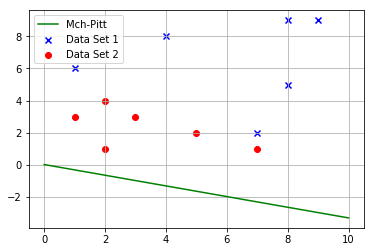
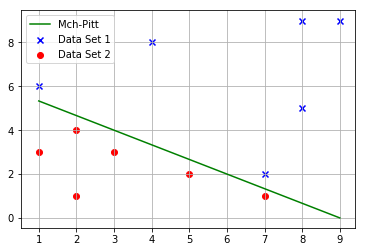
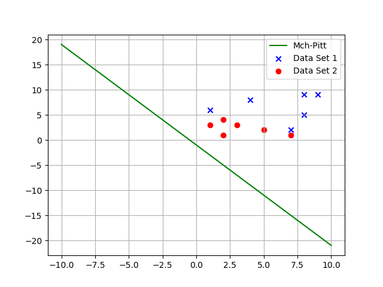

# Bias vs No Bias

A bias term simply allows for the translation of the decision boundary that the perceptron algorithm learns. When a bias term is not included, the decision boundary has to pass through the origin. This is termed as a **homogenous** solution.

A bais term in the equation will add the ability to a perceptron, to learn the decision boundary the does not pass through the origin.

## Unbaised Neuron

Consider the following data set


```python
from Figures import figure1
figure1.drawData()
```

Let us try learning a decision boundary with a perceptron that does not include the bais term. The boundary must pass through the origin and is called as a homogenous solution.


```python
figure1.drawNoBais()
```





As you can observe the algorithm fails to classify an entire class correctly. The above data set that was presented to the Perceptron is linearly separable, yet, it fails to classify the data correctly.

This phenomenon can be attributed to the fact that, without a bias term, the boundary must pass through the origin. With this additional restriction that is imposed on the perceptron, we can conclude by a simple observation of the data set that, such a boundary cannot be found.

You cannot find a linear boundary that passes through the origin and that seperates the above data perfectly.

### Gif of Decision boundary without Bias


## Biased Neuron


```python
from Figures import figure2
figure2.drawBais()
```





We now are able to classify the linearly separable dataset perfectly as we should be.

We are now able to learn a decision boundary that need not pass from the origin. The bais term that we have now included in the algorithm allows the boundary to have some intercept on both the axes. 

The above soloution is called a **non-homogenous** solution.

### Gif of Decision boundary with Bias

