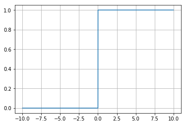
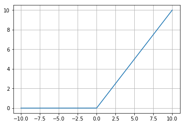
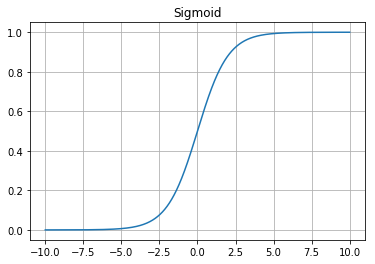
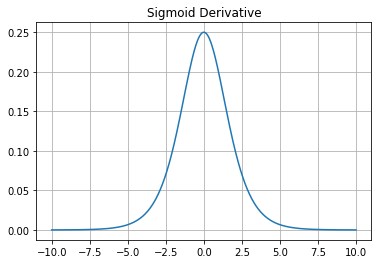
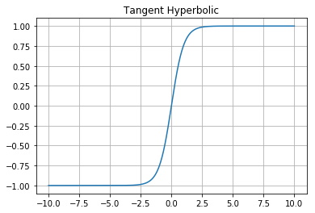
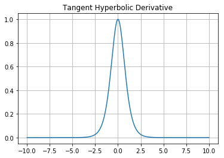

## Activation Function
Activation Function on  a node is defined as the output that is desired for  a given set of input values. There are two types of Activation Functions
<ol>
    <li>Linear Activation Function</li>
    <li>Non Linear Activation Function</li>
        <ul>
            <li>Binary Threshold Unit (BTU)</li>
            <li>Rectified Linear Neuron</li>
            <li>Sigmoid</li>
            <li>Tanhx</li>
    </ul>
    </ol>
    
Now let us see each one of them in detail.

### Linear Activation Function
It is defined by the funtion. Realising this activation function is simple but it is computationally limited.

<b>Function:</b>
$ \begin{align}
       y=x
        \end{align}
        $
        
<b>Mapping Domain and Range: </b>
$ \begin {align} f:(-\infty,\infty) \mapsto (-\infty,\infty) \end {align} $


```python
from Figures import Linear
Linear.draw()
```


    <Figure size 640x480 with 1 Axes>


### Non Linear Activation Function

These introduce non linear properties to the neural network. Using a non linear Activation we will be able to generate non-linear mappings from inputs to outputs

<b> 1) Binary Threshold Unit: </b>
<ul>
    <li>It is also called as the Threshold Logic Unit (TLU).</li>
    <li>The output is either 0 or 1 hence, it is Unipolar Binary Neuron. (Bipolar Binary Neurons output is -1 or +1 )</li>
    <li>The problem with this activation function is that even though it is non linear it is discontinuous at 0 and hence it is not differentiable.</li>
    <li>Hence it cant be used in Gradient descent optimization technique.</li>
</ul>


 


<b>Function:</b>

1) Consider $ \begin {align} z=\Sigma  x_iw_i \end{align} $, and  $ \begin {align} \theta=-b\end{align} $ then

$
y\quad=\quad
  \begin{cases}
    1       & \quad \text{if} \quad z > \theta \\
    0  & \quad \text{otherwise } 
  \end{cases}
$

 
2) Consider $ \begin {align} z=b+\Sigma  x_iw_i \end{align} $, then

$
y\quad=\quad
  \begin{cases}
    1       & \quad \text{if} \quad z > 0 \\
    0  & \quad \text{otherwise } 
  \end{cases}
$

 
<b> Mapping Domain and Range: </b>$ \begin {align} f:(-\infty,\infty) \mapsto [0,1] \end {align} $
 


```python
from Figures import BTU
BTU.draw()
```





<b> 2) Rectified Linear Unit: </b>
<ul>
    <li>This is also popularly called as <b>Relu</b> activation function.</li>
    <li>It is partly linear and partly non linear.</li>
    <li>The output is zero for all the negative values.</li>
    <li>That is the output does not change with the change in the negative values of input.</li>
    <li>It is simple and is more efficient. It is mainly used in the vanishing gradient problems.</li>


</ul>
<b>Function:</b>
 
Consider $ \begin {align} z=b+\Sigma  x_iw_i \end{align} $, then

$
y\quad=\quad
  \begin{cases}
    z       & \quad \text{if} \quad z > 0 \\
    0  & \quad \text{otherwise } 
  \end{cases}
$

 
<b> Mapping Domain and Range: </b>$ \begin {align} f:(-\infty,\infty) \mapsto [0,\infty) \end {align} $
 


```python
from Figures import Relu
Relu.draw()
```





<b> 3) Sigmoid: </b>
<ul>
    <li>It is fully non linear and is used in many Neural Networks.</li>
    <li>Used mainly in the binary classification problems.</li>
    <li>It is also called as the Logistic function.</li>
    <li>There is no discontinuity and hence derivative can be easily computed.</li>
    <li>The output is not zero centered.</li>
    <li>It is observed that in mapping the large range of input is mapped to very small range of output. Hence it makes it very convienient to analize the output. </li>
</ul> 
<b>Function:</b>
 
Consider $ \begin {align} z=b+\Sigma  x_iw_i \end{align} $, then

 $\begin {align} y \quad =  \frac{1}{(1+{e}^{-x})}
 \end{align} $
 
<b> Mapping Domain and Range: </b>$ \begin {align} f:(-\infty,\infty) \mapsto (0,1) \end {align} $

 
 
 <b>Derivative:</b> $\begin {align} y \quad =\quad y*(1-y)\end{align} $


```python
from Figures import Sigmoid
Sigmoid.draw()
Sigmoid.drawDerivative()
```








<b> 4) Tanhx: </b>
<ul>
    <li>It is fully non linear</li>
    <li>Output lies in the range of -1 and +1 and is zero centered.</li>
    <li>As it is zero centered, sometimes it is prefered more than Sigmoid function. But it still faces the Vanishing gradient problem</li>
    <li>Similar to Sigmoid activation function here also it is observed that in mapping the large range of input is mapped to very small range of output. Hence it makes it very convienient to analize the output. </li>
</ul> 


<b>Function:</b>
 
Consider $ \begin {align} z=b+\Sigma  x_iw_i \end{align} $, then

 We know that , $tanh(a \thinspace x) =  \Big[\frac{e^{a  x}-e^{-a x}}{e^{a  x}+e^{-a  x}}\Big]$ 
 
 If $a=1$ in the above equation  then we have,


 $\begin {align} y \quad =  \frac{({e}^{x}-{e}^{-x})}{({e}^{x}+{e}^{-x})}
 \end{align} $
 
<b> Mapping Domain and Range: </b>$ \begin {align} f:(-\infty,\infty) \mapsto (-1,1) \end {align} $


```python
from Figures import Tanhx
Tanhx.draw()
Tanhx.drawDerivative()
```







