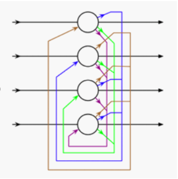
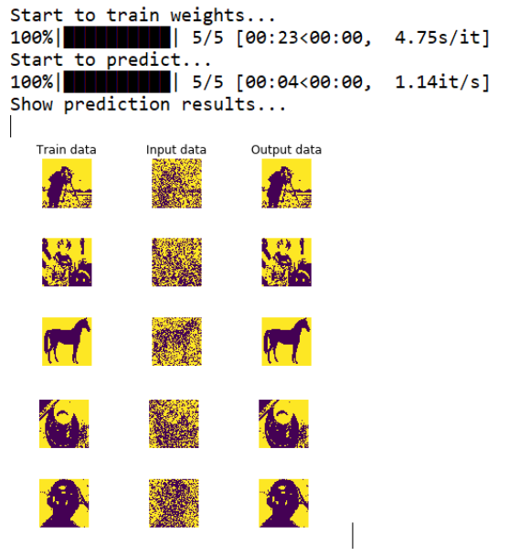
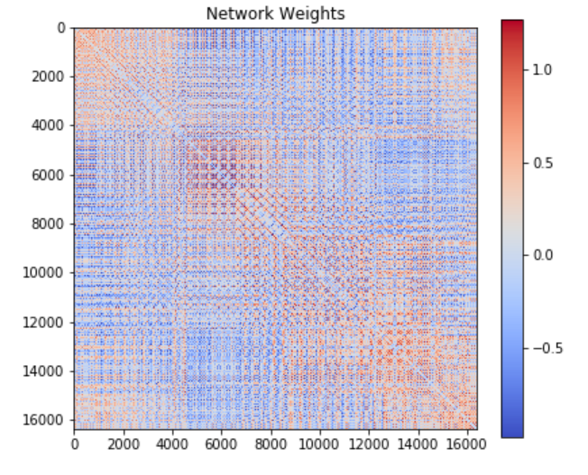

# Hopfield Neural Network

A Hopfield neural network is a type of artificial neural network invented by John Hopfield in 1982.
It usually works by first learning a number of binary patterns and then returning the one that is the most similar to a given input. It consists of a single layer which contains one or more fully connected recurrent neurons. The Hopfield network is commonly used for auto-association and optimization tasks.

Hopfield neural network with four nodes:



### Training Algorithm


During training of Hopfield network, weights will be updated. As we know that we can have the binary input vectors as well as bipolar input vectors. Hence, in both the cases, weight updates can be done with the following relation:


#### Case 1- Binary input patterns

For a set of binary patterns s(p), p = 1 to P

Here, $s(p) = s_1(p), s_2(p),....., s_i(p),.....,s_n(p)$

Weight Matrix is given by:

$$ w_{ij}=\ \displaystyle \sum_{p=1}^{P}[2s_i(p)-1][2s_j(p)-1] \ \ \ \ \ for\  i  \ne  j$$


#### Case 2- Bipolar input patterns

For a set of binary patterns s(p), p = 1 to P

$Here, s(p) = s_1(p), s_2(p),..., s_i(p),..., s_n(p)$

Weight Matrix is given by:

$$ w_{ij}=\  \displaystyle \sum_{p=1}^{P}[s_i(p)][s_j(p)] \ \ \ \ \    for\ i  \ne  j$$

### Testing Algorithm

Step 1 − Initialize the weights, which are obtained from training algorithm by using Hebbian principle.


```python
# Hebb rule
        for i in tqdm(range(num_data)):
        t = train_data[i] - rho
        W += np.outer(t, t)
```

Step 2 − Perform steps 3-9, if the activations of the network is not consolidated.

Step 3 − For each input vector X, perform steps 4-8.

Step 4 − Make initial activation of the network equal to the external input vector X as follows −
$y_i=x_i$   for i=1 to n

Step 5 − For each unit $Y_i$, perform steps 6-9.

Step 6 − Calculate the net input of the network as follows –

$$ y_{ini}=\  x_i + \displaystyle \sum_{j}y_iw_{ji} $$

Step 7 − Apply the activation as follows over the net input to calculate the output –

$ y_i = 1 \ \ \ \   if\ \   y_{ini} > \theta_i $

$ y_i = y_i \ \ \ \ if\ \  y_{ini} = \theta_i $

$ y_i = 0 \ \ \ \   if\ \  y_{ini} < \theta_i $

Here $\theta_i$ is the threshold.

Step 8 − Broadcast this output $y_i$ to all other units.

Step 9 − Test the network for conjunction.


### Energy Function Evaluation
An energy function is defined as a function that is bonded and non-increasing function of the state of the system.
Energy function $E_f$, also called Lyapunov function determines the stability of discrete Hopfield network, and is characterized as follows –

$$ E_f=\ -\frac{1}{2} \displaystyle \sum_{i=1}^{n}\displaystyle \sum_{j=1}^{n}y_iy_jw_{ij} \ - \displaystyle \sum_{i=1}^{n}x_iy_i \ + \ \displaystyle \sum_{i=1}^{n}\theta_iy_i $$


```python
# Create Hopfield Network Model
    model = network.HopfieldNetwork()
    model.train_weights(data)

# Generate testset
    test = [get_corrupted_input(d, 0.3) for d in data]
    predicted = model.predict(test, threshold=0, asyn=False)
    print("Show prediction results...")
    plot(data, test, predicted)
```




```python
 def plot_weights(self):
        plt.figure(figsize=(6, 5))
        w_mat = plt.imshow(self.W, cmap=cm.coolwarm)
        plt.colorbar(w_mat)
        plt.title("Network Weights")
        plt.tight_layout()
        plt.savefig("weights.png")
        plt.show()
        print("Show network weights matrix...")
        model.plot_weights()
```



### Continuous Hopfield Network
In comparison with discrete Hopfield network, continuous network has time as a continuous variable. It is also used in auto association and optimization problems such as travelling salesman problem.

Model − The model or architecture can be build up by adding electrical components such as amplifiers which can map the input voltage to the output voltage over a sigmoid activation function.

### Travelling Salesman Problem
Finding the shortest route travelled by the salesman is one of the computational problems, which can be optimized by using Hopfield neural network.


###### Energy Function Calculation
To be the optimized solution, the energy function must be minimum.On the basis of the cost function and constraint value, the energy function E can be given as follows −

$$ E=\ -\frac{1}{2} \displaystyle \sum_{i=1}^{n}\displaystyle \sum_{x}\displaystyle \sum_{y \ne x}C_{x,y}M_{x,i}(M_{y,i+1} 
+ M_{y,i-1}) + [Y_1\displaystyle \sum_{x}(1-\displaystyle \sum_{i}M_{x,i})^2 + Y_2\displaystyle \sum_{i}(1-\displaystyle \sum_{x}M_{x,i})^2]$$

Here, $    Y_1   and    Y_2$ are two weighing constants.


### N-queen problem
The N Queen is the problem of placing N chess queens on an N×N chessboard so that no two queens attack each other.
The expected output is a binary matrix which has 1s for the blocks where queens are placed. For example, following is the output matrix for 4 queen solution.


