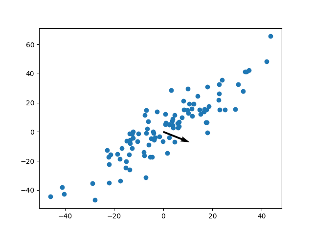

## Hebbian Learning
According to this learning rule if the output and input are co-related (i.e., if both are increasing or both are decreasing) only then the weights update else they does not. The weight update rule according to hebbian rule is as follows

$w_{ij}(t+1) = w_{ij}(t)+\eta . y_j(t).x_i(t)$

After training, the weight vector aligns itself in the direction in which x,y are maximally co-related. It is sort of NN version of Principal Component Analysis.

It is mainly used for orientation selectivitiy of Single Hebbian Neuron.

Below illustration helps us understand the way in which weight vector aligns itself in the direction of maximum co-relation.

### Disadvantage:
The main disadvantage of Hebbian rule is that it keeps on updating the weights which grow large and become insensitive to any changes in input. To overcome this disadvantage we use OJA's weight updtae rule which adds a regularization term to the weight update eqaution 
$\Delta w_i = \eta(x_i.y-y^2.w_i)$

