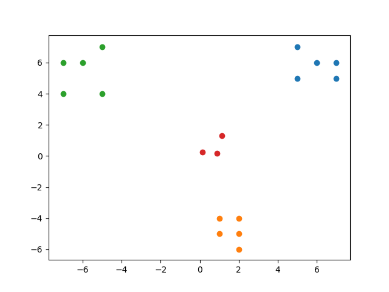

## Competitive Learning

It works on the concept of <b>Winner takes all</b>. It is mainly used in <b>Clustering</b>

The weight update rule in Competitive learning is as follows:

$\Delta w_{ij} =
  \begin{cases}
    \eta(x_j^{\mu}-w_{i^*j})      & ,i=i^* \\
    0  & ,i\neq i
  \end{cases}
$

where $i^*$ is the winner, which means that the distance between a particular a particular input pattern $x_j^{\mu}$ and the weight vector $w_{i^*j}$ is minimum. Hence only this winner weight vector is updated and the rest of the weight vectors are not updated.

Below are the steps performed competitive learning:
<ol>
    <li>Perform dot product of all the weight vectors with one input pattern.</li>
    <li>If the weight vector is closer to the input pattern then it gives bigger dot product value.</li>
    <li>This winning weight vector is updtaed according to the above mentioned rule and it comes closer to the input pattern.</li>
</ol>

After following the above steps for some time the weights settle inbetween the inputs and the difference $(x_j^{\mu}-w_{i^*j}) $ becomes very small and hence the weight update is neglected.

Below illustration shows the weight update based on competitive learning.

### Improvised Competitive Learning:
We observe that the traditional competive learning does specialised training on a particular weight vector. Instead the loser weight vectors can also be updated. The intensity of training will be based on how far the point is from winner weight vector.
