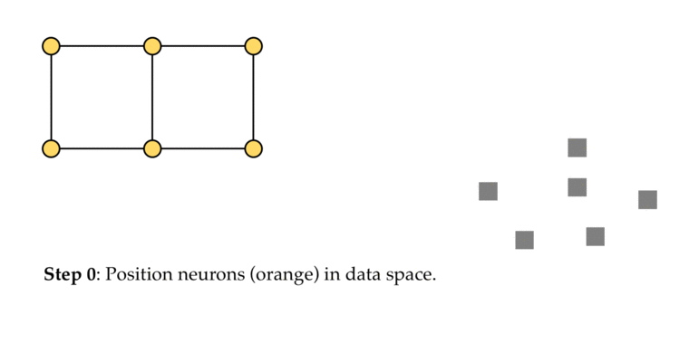

# Self Organizing Map(SOM)

A ***self-organizing map*** (SOM) or ***self-organizing feature map*** (SOFM) is a type of artificial neural network (ANN) that is trained using unsupervised learning to produce a low-dimensional (typically two-dimensional), discretized representation of the input space of the training samples, called a map, and is therefore a method to do dimensionality reduction. Self-organizing maps differ from other artificial neural networks as they apply **competitive learning** as opposed to error-correction learning (such as backpropagation with gradient descent), and in the sense that they use a neighborhood function to preserve the topological properties of the input space.


* A Self-Organizing Map (SOM) is a way to represent higher dimensional data in an usually 2-D or 3-D manner, such that similar data is grouped together.

* It runs unsupervised and performs the grouping on its own.

* Once the SOM converges, it can only classify new data.  It is unlike traditional neural nets which are continuously learning and adapting.

* SOMs run in two phases:
    1. *Training phase*: map is built, network organizes using a competitive process, it is trained using large numbers of inputs (or the same input vectors can be administered multiple times).
    2. *Mapping phase*: new vectors are quickly given a location on the converged map, easily classifying or categorizing the new data.

## Training 

So how does the SOM grid learn the shape of our data? Well, this is done in an iterative process, which is summarized in the following steps, and visualized in the animated GIF below:

**Step 0**: Randomly position the grid’s neurons in the data space.

**Step 1**: Select one data point, either randomly or systematically cycling through the dataset in order

**Step 2**: Find the neuron that is closest to the chosen data point. This neuron is called the Best Matching Unit (BMU).

**Step 3**: Move the BMU closer to that data point. The distance moved by the BMU is determined by a learning rate, which decreases after each iteration.

**Step 4**: Move the BMU’s neighbors closer to that data point as well, with farther away neighbors moving less. Neighbors are identified using a radius around the BMU, and the value for this radius decreases after each iteration.

**Step 5**: Update the learning rate and BMU radius, before repeating Steps 1 to 4. Iterate these steps until positions of neurons have been stabilized.



## Visializing the SOM training

The code below creats 200 random points and has a som trainig on it. 

In the gif below you can see how SOM learns the shape of the data and stabilises after some epochs.


```python
from som import SOM
import numpy as np
```


```python
kohen_map = SOM(10, 10)

# Create data
data = np.random.randint(low=1, high=50, size=(200, 2))
# Train
kohen_map.fit(data, epochs=500)

## For two classes
data1 = np.random.randint(low=10, high=40, size=(100,2))
data2 = np.random.randint(low=50, high=90, size=(100,2))
som = SOM(10, 10)
som.fit(data1, 500, data2=data2)
```

    Epoch 499;    Neuron [3, 5];    	Sigma: 0.2941;    alpha: 0.0353
    Writing the gif file...
    Done
    Epoch 499;    Neuron [4, 3];    	Sigma: 0.2941;    alpha: 0.0353
    Writing the gif file...
    Done


**Re-run this cell after executing the above cell to get the updated plot**


### Similarly, for two classes...


